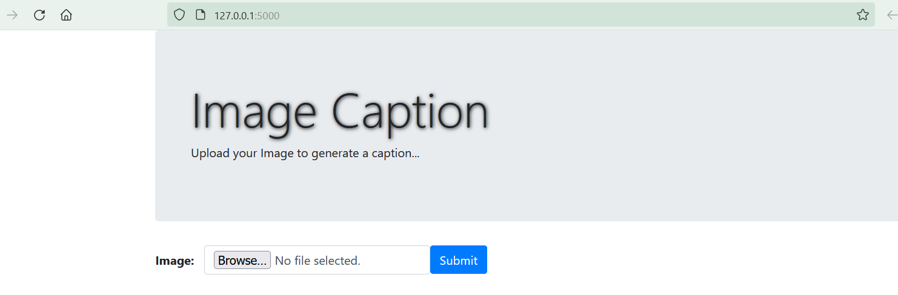
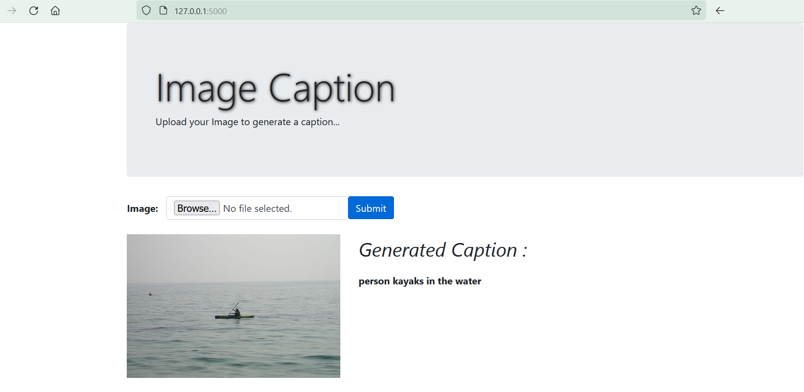

# Caption_generation

## Objectives

- Understand and use natural language generation.
- Combining Computer vision and NLP.
- Use transfer learning.

## The Mission

Facebook wants to develop a deep learning model that allows to generate a text description from a photo. This is a big technical challenge because you have to combine your computer vision and NLP skills.

## The Solution
The Flickr8k_datase consisting of 8,000 images that are each paired with five different captions.
nThe pre-trained model Inception v3 with dataset ImageNet is used to get the embedding vector, The text is processed before to give it to the model. 
The model consists of Convolutional Neural Network(CNN) as well as Long short-term memory (LSTM). The CNN is used for feature extraction from image and LSTM is used for sentence generation. 
The model is trained in such a way that if input image is given to model it generates captions which nearly describes the image. 
Create an app That takes an image as input and returns the caption.

Input 

Output

## Installation

- [numpy](https://numpy.org/)

- [pandas](https://pandas.pydata.org/)

- [sklearn](https://scikit-learn.org/stable/install.html)

- [Tensorflow](https://www.tensorflow.org)

## Usage

All notebooks are in the notebooks folder

## Contributors

- #### [Malika Obkiche](https://github.com/obkiche)

